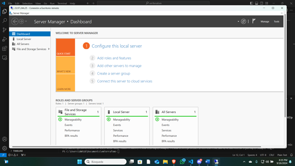
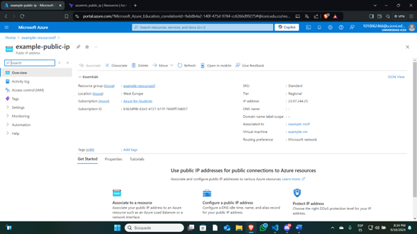
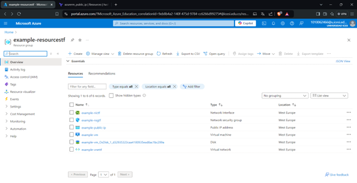
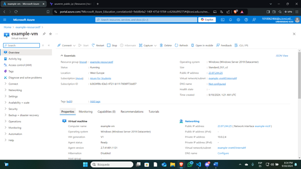
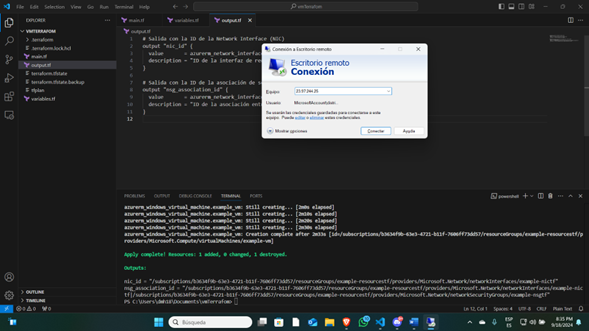

# Terraform - Azure Virtual Machine Deployment

Este proyecto crea una infraestructura básica en Azure utilizando Terraform, la cual incluye una máquina virtual con acceso RDP, una red virtual, subred, IP pública y un grupo de seguridad de red.

## Requisitos

- [Terraform](https://www.terraform.io/downloads) instalado en tu máquina.
- Una suscripción de Azure.
- Autenticación configurada con Azure CLI o mediante un `service principal`.

## Archivos principales

### `main.tf`

Define los recursos de Azure necesarios:

- **Provider**: Configura el proveedor de Azure para la suscripción.
- **Resource Group**: Un grupo de recursos donde se alojarán todos los componentes.
- **Virtual Network**: La red virtual que define el espacio de direcciones.
- **Subnet**: La subred dentro de la red virtual.
- **Network Security Group (NSG)**: Define las reglas de seguridad para permitir el tráfico SSH (puerto 22) y RDP (puerto 3389).
- **Network Interface**: La interfaz de red de la máquina virtual.
- **Public IP**: Una dirección IP pública con SKU estándar.
- **Windows Virtual Machine**: Una máquina virtual basada en Windows Server 2019 Datacenter.

### `variables.tf`

Define las variables utilizadas en el `main.tf`, tales como:

- ID de suscripción.
- Nombre del grupo de recursos, red virtual, subred, y la interfaz de red.
- Espacios de direcciones IP.

### `output.tf`

Proporciona las salidas de las IDs de algunos de los recursos creados:

- ID de la interfaz de red (NIC).
- ID de la asociación de seguridad entre la NIC y el NSG.

## Uso

1. **Clona el repositorio** en tu máquina local:

   ```bash
   git clone https://github.com/tu-repositorio/terraform-azure-vm.git
   cd terraform-azure-vm
   ```

2. **Inicializa el proyecto de Terraform para descargar los proveedores necesarios**:
    ```bash
    terraform init
    ```

3. **Revisa el plan de ejecución para asegurarte de que los recursos que se van a crear son correctos**:
    ```bash
    terraform plan
    ```
4. **Aplica los cambios para crear la infraestructura en Azure**:
    ```bash
    terraform apply
    ```
5. **Obtención de la Dirección IP Pública: Se obtiene la dirección IP pública de la máquina virtual**:
    ```bash
    terraform output
    ```

# Acceso a la Máquina Virtual
## Conexión RDP (Windows)
1. Abrir el Escritorio remoto.
2. Ingresar la IP pública obtenida.
3. Utilizar las credenciales definidas en el archivo main.tf.

# Conclusión
La implementación de una máquina virtual en Azure utilizando Terraform simplifica significativamente el proceso de provisión y gestión de infraestructura. A través de una configuración declarativa, se puede asegurar que todos los recursos necesarios sean creados de manera coherente y reproducible. Esta metodología no solo facilita el despliegue inicial, sino que también permite un fácil escalado y mantenimiento de los recursos a lo largo del ciclo de vida de la infraestructura. 

# Notas Adicionales
* Las credenciales y valores sensibles deben ser modificados antes de un despliegue en producción.
* La dirección IP pública se ha configurado como estática para mantener su asignación durante reinicios.

## Imágenes

A continuación se muestran algunas imágenes relevantes a la implementación:







------------------------

## Modularización

Informe de Modularización del Código en Terraform
# Visión General
El código de Terraform, encargado de aprovisionar una infraestructura en Azure, ha sido modularizado para adherirse a mejores prácticas de desarrollo. Este proceso facilita la gestión, mejora la legibilidad y permite una mayor escalabilidad. El enfoque principal fue la separación de los recursos de creación de la máquina virtual (VM) en un módulo independiente.

# Estructura de Archivos
Antes de la modularización
Inicialmente, todos los recursos estaban centralizados en un único archivo main.tf ubicado en el directorio raíz. Esto incluía la configuración del grupo de recursos, la red virtual, la subred, las reglas de seguridad, la IP pública, la interfaz de red y la máquina virtual. Este enfoque dificultaba el mantenimiento y reducía la flexibilidad a medida que la infraestructura crecía.

# Después de la modularización
Con la modularización, los recursos se agruparon por responsabilidad en módulos y archivos independientes:

## Directorio raíz:

main.tf: Incluye la configuración del proveedor de Azure, la creación del grupo de recursos, red virtual, subred, grupo de seguridad, IP pública e interfaz de red, además de la invocación al módulo de máquina virtual.
variables.tf: Define variables globales como nombres de recursos, tamaños de VM y credenciales de administrador.
Módulo vm:

main.tf: Define la máquina virtual y sus configuraciones usando las variables pertinentes.
variables.tf: Almacena las variables específicas del módulo, como el tamaño de la VM, credenciales y la interfaz de red asociada.
Cambios Implementados
1. Separación de Recursos:
Los recursos relacionados directamente con la creación de la máquina virtual (azurerm_virtual_machine) fueron movidos del main.tf raíz a un main.tf dentro del nuevo módulo vm.

2. Creación del Módulo vm:
   
Se creó un módulo específico para la máquina virtual ubicado en modules/vm. Este módulo incluye:

Un main.tf que gestiona la creación y configuración de la VM.
Un variables.tf que define las variables requeridas para parametrizar el módulo, tales como tamaño de la VM, credenciales y la interfaz de red.

3. Invocación del Módulo desde el Directorio Raíz:
El main.tf en el directorio raíz ahora utiliza el bloque module para invocar el módulo vm. Las variables necesarias, como resource_group_name, location y network_interface_id, se pasan al módulo para la configuración de la VM.

4. Reestructuración de Variables:
Las variables asociadas con la máquina virtual, como vm_size y las credenciales, fueron trasladadas al módulo vm. Estas variables ya no se gestionan en el archivo variables.tf del directorio raíz, lo que mejora la separación de responsabilidades.

Beneficios de la Modularización
1. Claridad y Organización
El código ahora está mejor estructurado. Los recursos relacionados con la creación de la máquina virtual están encapsulados en su propio módulo, mientras que otros recursos de red y seguridad permanecen en el directorio raíz. Esto facilita la lectura y comprensión del código.

2. Reutilización
El módulo vm puede utilizarse en otros proyectos o entornos con facilidad. Solo se necesita ajustar los valores de las variables para adaptarlo a diferentes escenarios, lo que fomenta la reutilización del código.

3. Facilidad de Mantenimiento
La separación en módulos permite que los cambios futuros sean aplicados de forma localizada sin afectar al resto de los componentes. Esto reduce el riesgo de introducir errores y facilita la actualización y expansión de la infraestructura.

